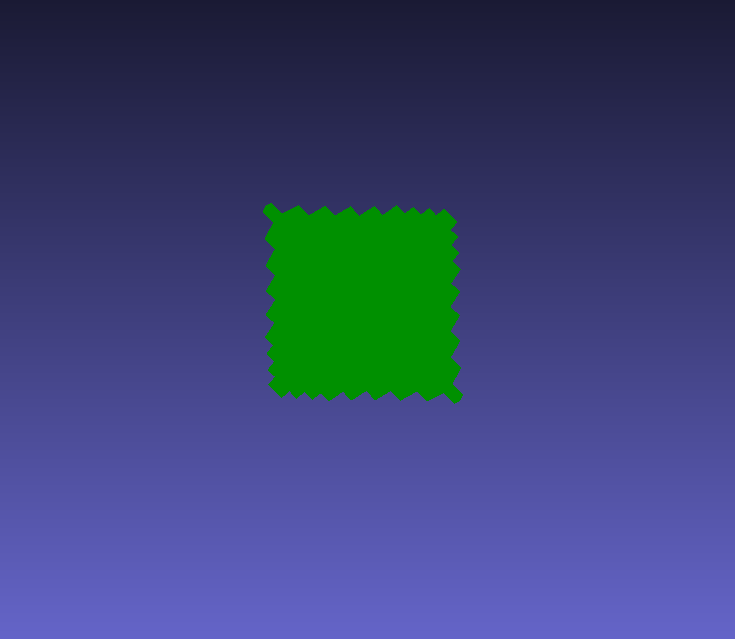
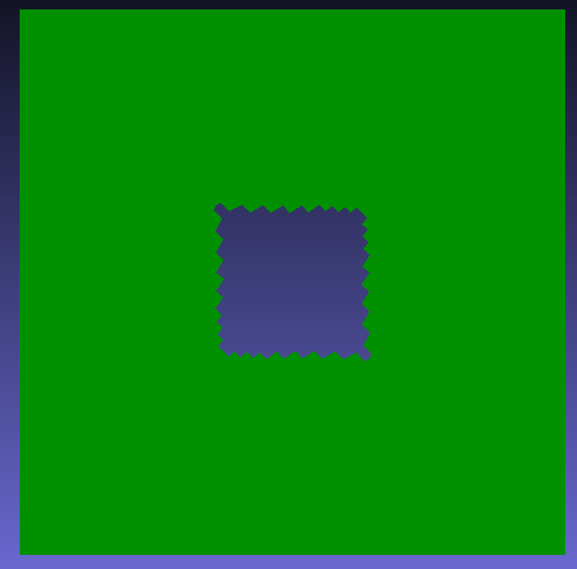
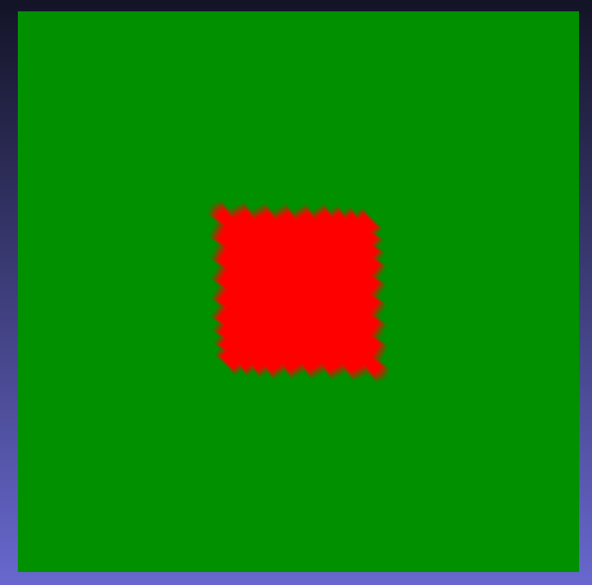

# Scan Integration

This package contains libraries useful for integrating images into scans

## Libraries

All libraries in this package are exported as targets under the namespace `pcs`

### Octomap_mesh_masking

This library provides a class that masks a mesh with an octomap. During scanning, an octomap may have been generated using octomap_server and functions in pcs_detection. The user may then wish to extract the areas of the mesh (from YAK for example) that are inside the octomap. 

One useful feature of this class is the ability to set the octree from a colorized pointcloud. During scanning, the octomap is often colorized based on regions where a certain feature is detected. This can be retrieved as a colorized pointcloud with a point at the center of each leaf. The setOctree function allows a threshold on color to be set whereby only points where the r, g, and b channel values are within the limits are added to the octree.

When applying the mask there are 3 options.
  * RETURN_INSIDE - Returns only the mesh inside the masking
  * RETURN_OUTSIDE - Returns only the mesh outside the masking
  * RETURN_COLORIZED - Returns the entire mesh but colorizes it based on what is inside/outside the masking

#### RETURN_INSIDE

#### RETURN_OUTSIDE

#### RETURN_COLORIZED

